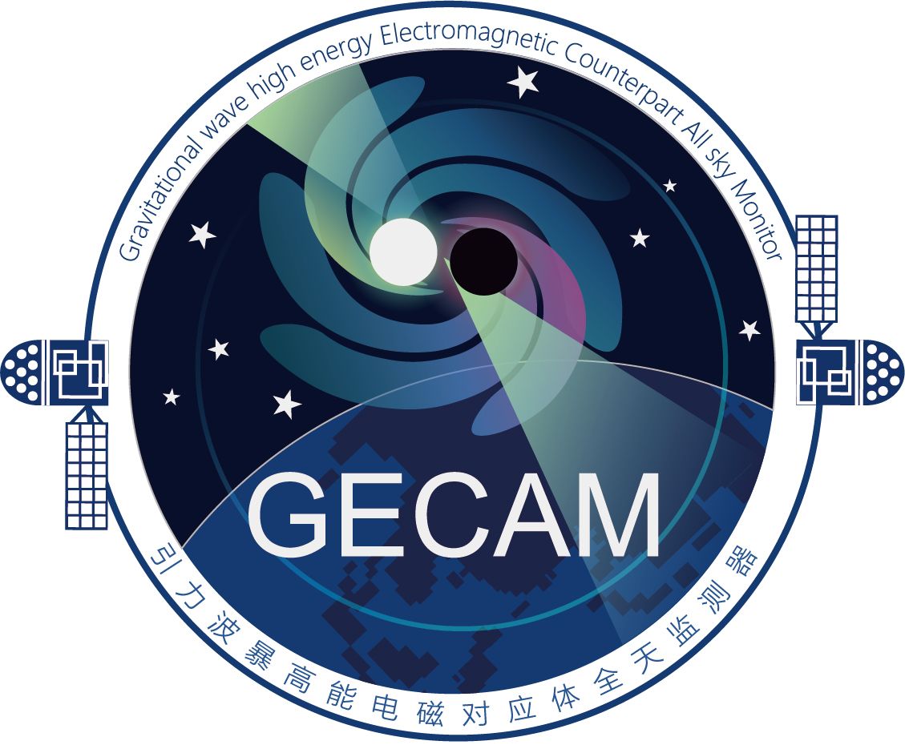

[English](README_en.md)
|
[中文](README.md)
|

  

# GECAM Data Analysis Tool (GECAMTools)

## Introduction
GECAMTools is the application programming interface (API) for GECAM data. This tool is implemented based on python3, with the aim of allowing general users to integrate GECAM data analysis into their own scripts and workflows without having to worry about too many details. To achieve this, this tool has a high-level API layer that allows users to read, simplify, and visualize GECAM data with just a few lines of code. For expert users and those who want fine control over various aspects of their analysis, this tool provides a lower-level API layer. The tool currently implements basic data analysis functions, including time conversion, viewing light curves, viewing spectra, generating response files, and generating spectrum files for spectrum fitting.
In addition, the design of GECAMTools takes into account generality. The data interface of this tool currently uses GECAM data, but many functionalities can be extended to data from other instruments through inheritance. Even if the data file definitions are different from those of GECAM, once the reading interfaces of these data files are redefined, this tool can be used for subsequent analysis.

Developers:  
Peng Zhang (IHEP), Wangchen Xue (IHEP), Yanqiu Zhang (IHEP), and Shaolin Xiong* (IHEP)

Email:  
Shaolin Xiong* (xiongsl@ihep.ac.cn)  
Peng Zhang (zhangp97@ihep.ac.cn), for feedback on the installation and use of GECAMTools.

### GECAM Introduction and Data Release Website: [Link](http://gecam.ihep.ac.cn/)

---
## Features
1. Time conversion
2. Viewing light curves and spectra
3. Generating spectrum files (fitting background light curves, outputting total spectrum, background spectrum, and net spectrum)
4. Calculating T90

---
## Instructions

### Required Environment
1. Operating System: Windows, Linux, Mac
2. Python Environment: Python version >= 3.6

### Installation Process
1. Download the source code  
`gecamTools-master.zip`

2. Installation  
2.1 For basic functionality only (i.e., without generating response matrices)  
Use pip to install the source code, automatically installing GECAMTools and related dependencies  
`pip install gecamTools-master.zip`

It is recommended to use Anaconda to create an independent Python environment to prevent compatibility issues with different software dependencies.
[Miniconda Instructions](https://www.jianshu.com/p/7299c2d4d170)

2.3 Testing  
`import gecam`

### Uninstallation Process  
`pip uninstall GECAMTools`

---
## Version History
### v20240514
#### Source Code and User Manual
[Download from IHEPBox](https://ihepbox.ihep.ac.cn/ihepbox/index.php/s/x6HkDidQ8eCvrrG)

#### Updates
Bug Fixes: 
1. Corrected the issue of time bin and spectrum source interval floating point precision causing time overlap in time-resolved spectra
2. Improved the robustness of T90 calculation
3. Removed restrictions on dependencies of higher versions of libraries
